### Previous Questions - 20/08

1. When we run create database, what happens? Some metadata is stored; beyond that is some space allotted to it.

<table>
  <tr>
    <td width="50%">
      <h3>Newly Installed SQL</h3>
      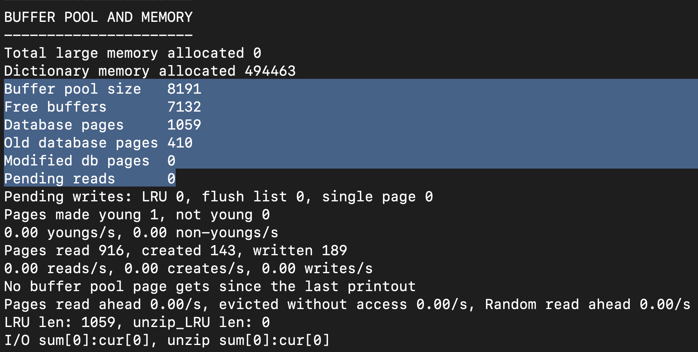
      <ul>
        <li><b>Buffer Pool:</b> total number of pages that InnoDB can hold.</li>
        <li>Each page = 16 KB.</li>
        <li>Buffer pool size = 8191 * 16 KB ≈ 128 MB.</li>
        <li><b>Old Database Pages:</b> number of old pages in LRU.</li>
        <li>InnoDB splits into Young list & Old list.</li>
        <li><b>LRU Length:</b>1059 = Database pages len.</li>
      </ul>
    </td>
    <td width="50%">
      <h3>After Creating Database</h3>
      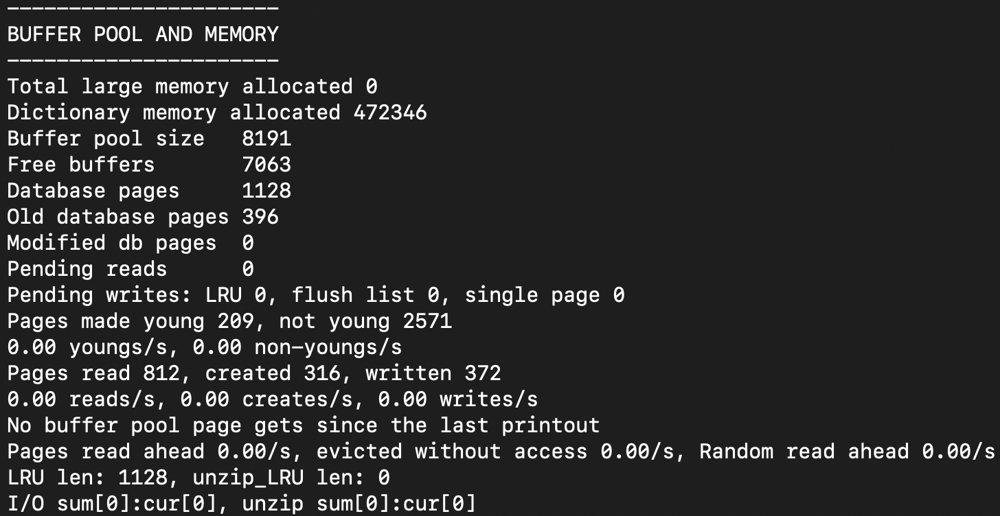
      <ul>
        <li><b>Free buffers:</b> 7132 → 7063 (69 pages allocated).</li>
        <li><b>Background pre-allocation:</b> InnoDB reserves pages for extents.</li>
        <li><b>Extent:</b> 64 pages (1 MB).</li>
        <li>5 pages used for metadata + indexes.</li>
        <li><b>Database Pages: </b> 1059 -> 1128 = 69 pages.</li>
        <li><b>LRU Length:</b>1128 pages</li>
      </ul>
    </td>
  </tr>
</table>

---

2. When we create a table, what happens, some metadata is stored, and beyond that is some space allotted to it.

<table>
  <tr>
    <td width="50%">
      <h3>Before Creating Table</h3>
      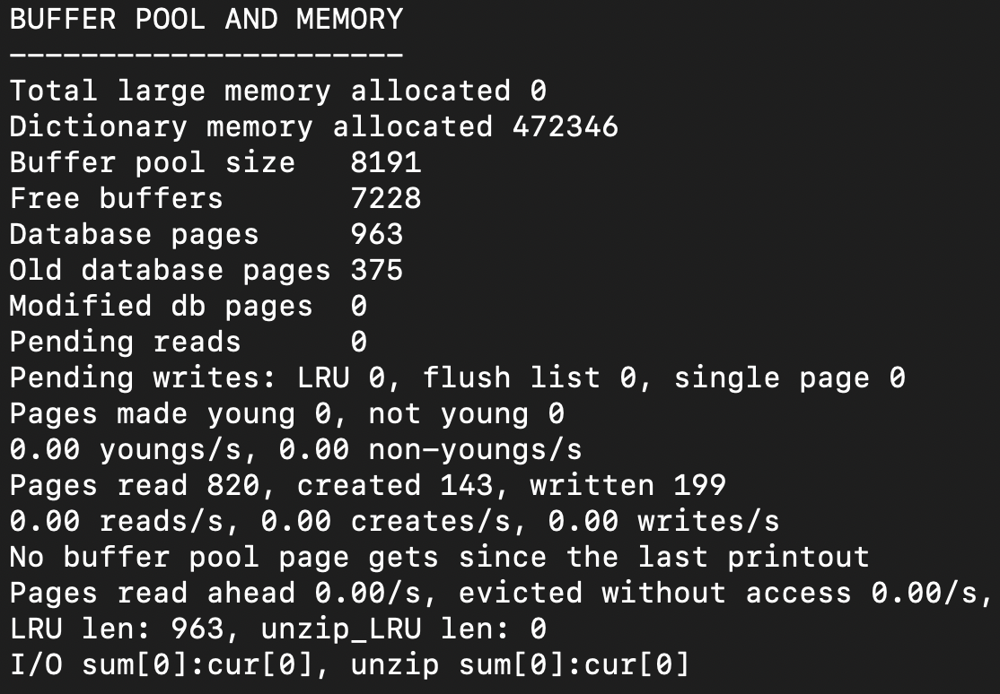
      <ul>
        <li>Modified Db pages 0 - Dirty pages</li>
      </ul>
    </td>
    <td width="50%">
      <h3>After Creating Table</h3>
      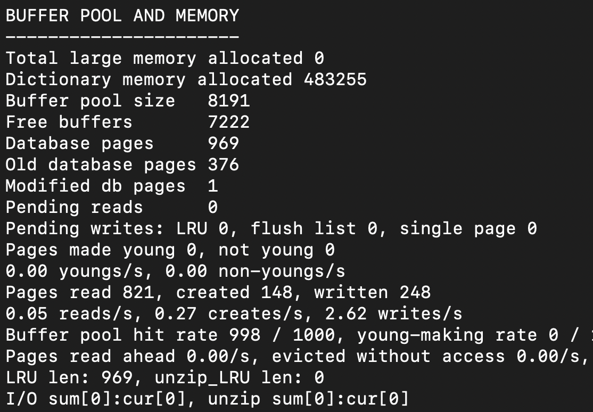
      <ul>
        <li>Modified DB pages: 1</li>
        <li>After Flushing to Disk, modified db pages goes to 0.</li>
        <li>Around 6 to 10 free pages used when table created.</li>
      </ul>
    </td>
  </tr>
</table>

---

3. When Inserting in a table

<table>
  <tr>
    <td width="25%">
      <h3>Before Insertion</h3>
      
    </td>
    <td width="25%">
      <h3>After 1 row INSERTION</h3>
      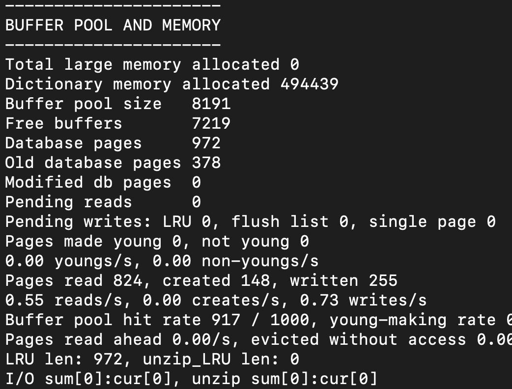
    </td>
    <td width="25%">
      <h3>2nd row insertion</h3>
      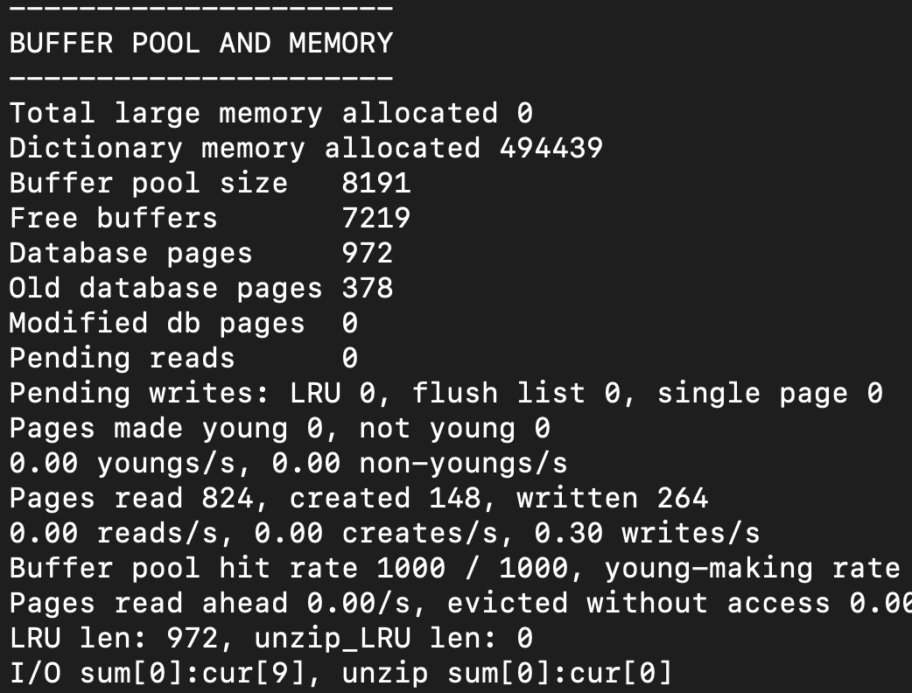
    </td>
    <td width="25%">
      <h3>3rd row INSERTION</h3>
      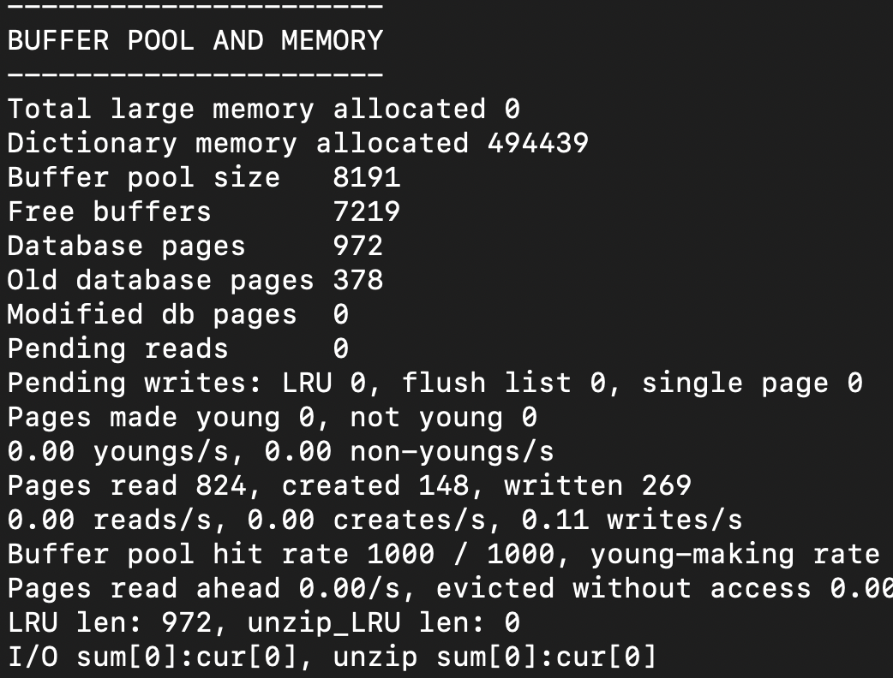
    </td>
  </tr>
</table>

---

4. How are these pages managed, and how does one access the page?

<table>
  <tr>
    <td width="25%">
      <h3>Before Insertion</h3>
      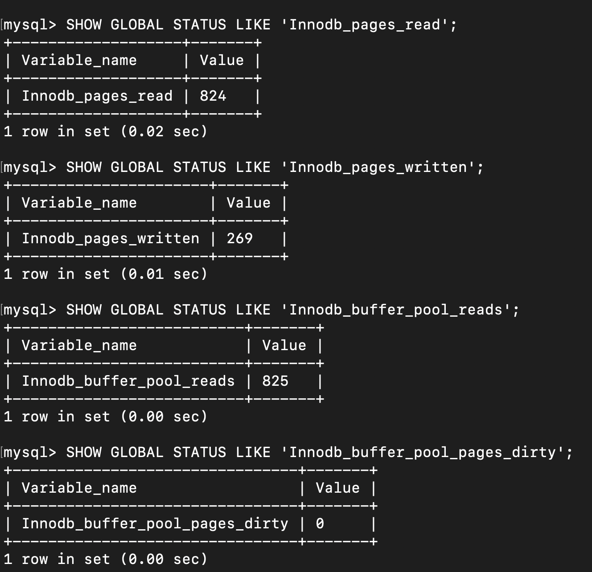
    </td>
    <td width="25%">
      <h3>After 1 row INSERTION</h3>
      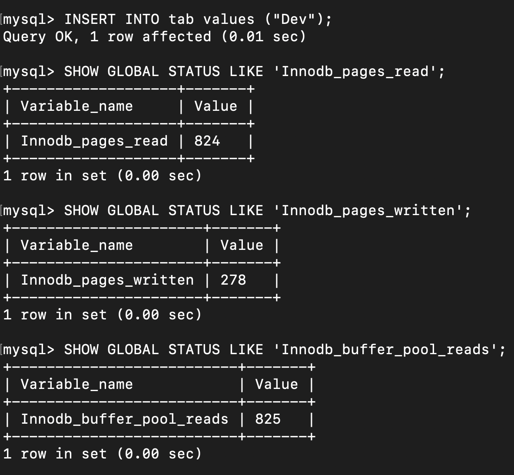
    </td>
    <td width="25%">
      <h3>2nd row insertion</h3>
      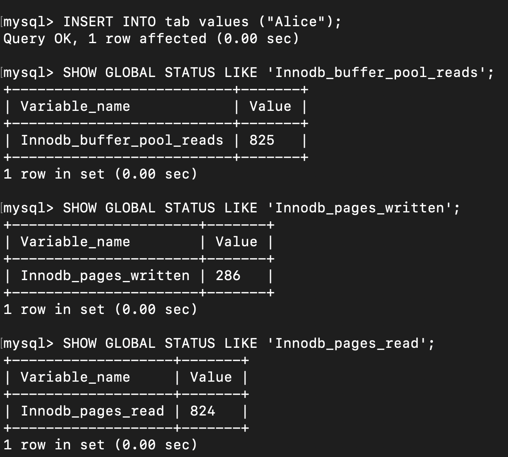
    </td>
    <td width="25%">
      <h3>3rd row INSERTION</h3>
      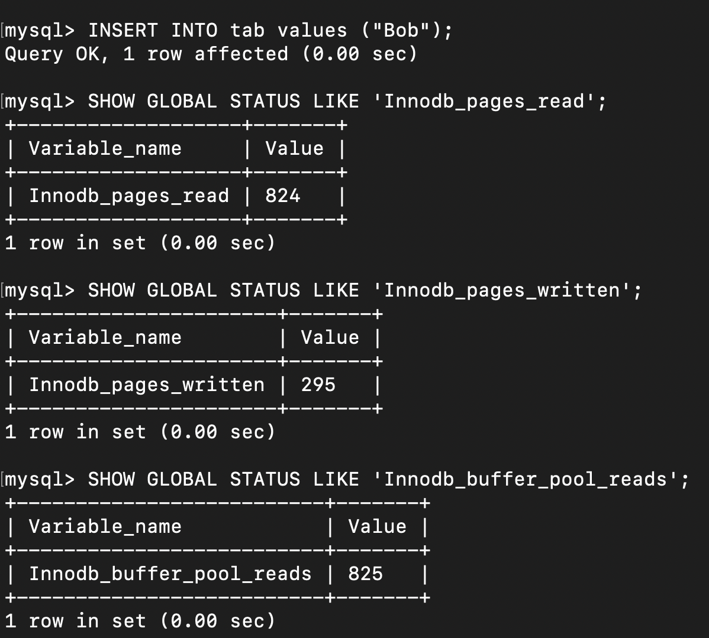
    </td>
  </tr>
</table>

- At every time 6 to 10 pages are writing to the disk - Redo/undo logs + actual page + indexing pages.
- No reads from disk when already exists in cache - read from cache, update in cache, then update to disk.

---

5. How is data inserted into the page? There is an application data structure, and a disk block from disk. Are changes made in the application data structure and copied to the disk block in the main memory buffer, or directly the main memory buffer copy of the disk block modified directly?

- Each process uses a thread that points to the buffer pool page instead of making a copy.
- Updates are applied directly to the cached page, with locks ensuring other threads cannot access it simultaneously.

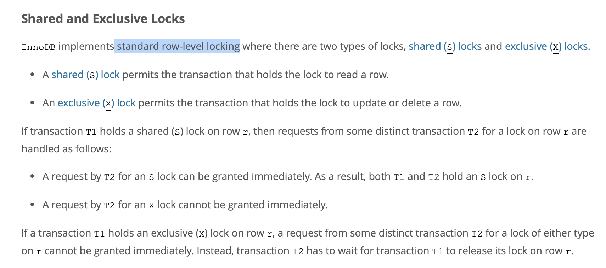