### Questions - 25/08

1. **Handling Pages:** When inserting a row into a table, the DBMS checks if the current page has enough free space; if not, it allocates a new page from the free list. But if the row is larger than a single page, how is it handled?

### Postgres

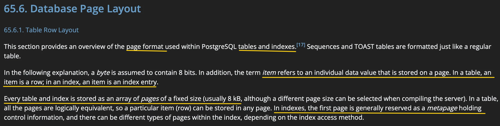
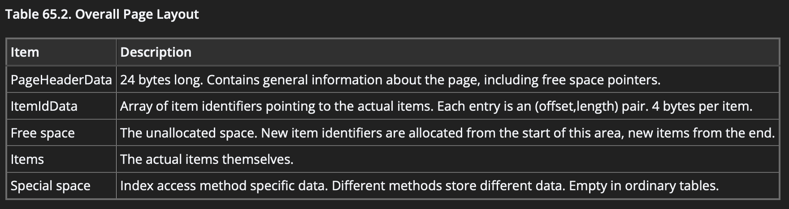
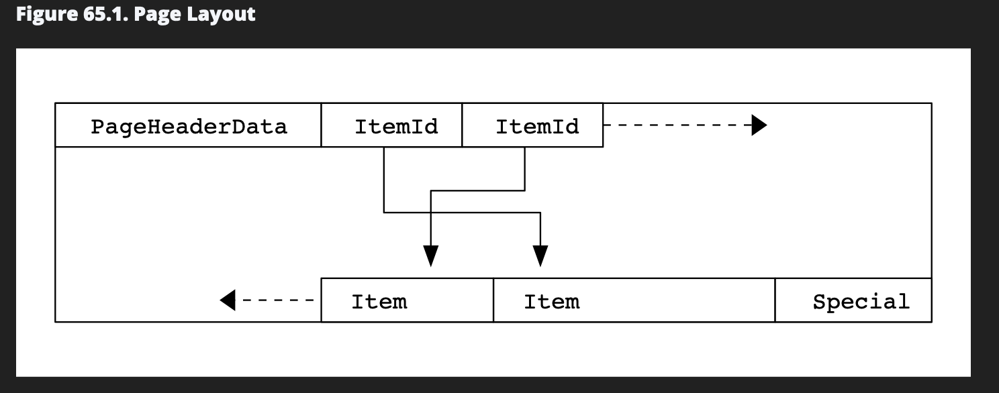

### Page Header Layout

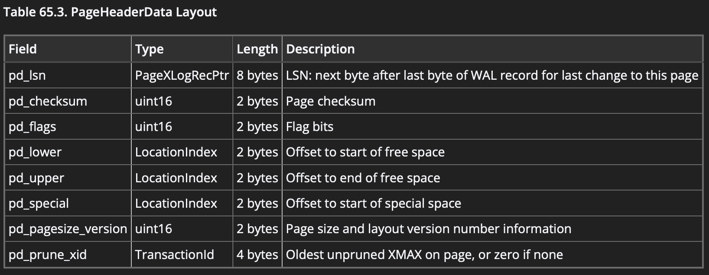

### Page Header Data Example

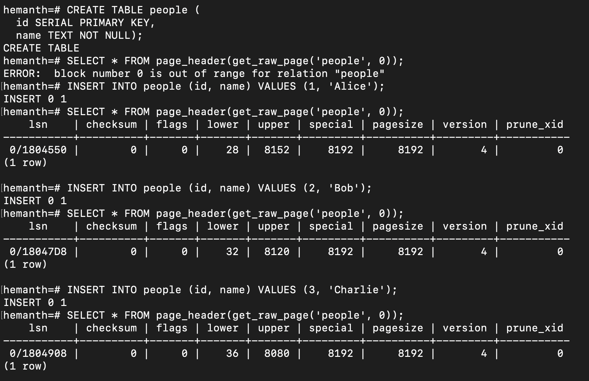

*When a table is created, no disk pages are allocated initially; pages are created only when rows are inserted.

### Each Tuple Size

- _First Insert:_ 8192 → 8152 = 40 bytes
- _Second Insert:_ 8152 → 8120 = 32 bytes
- _Third Insert:_ 8120 → 8080 = 40 bytes
  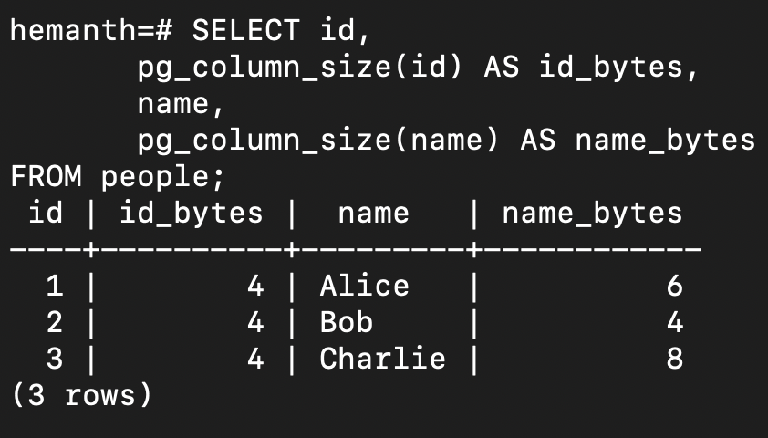
  Q. Int is 4 bytes and name is (1 length header + actual data bytes) ~8 bytes. Then what is remaining 23 bytes?
  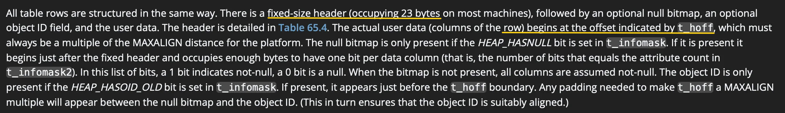
  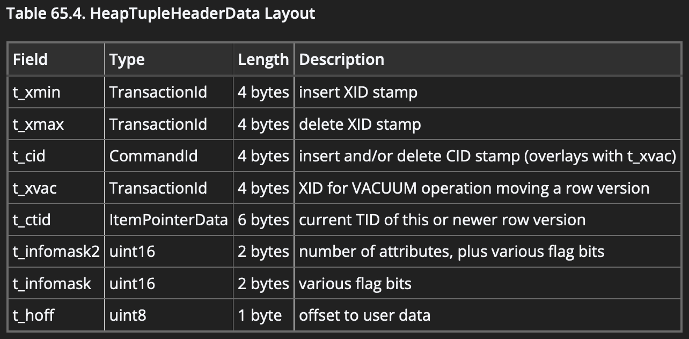

### Inserted Rows tuple details

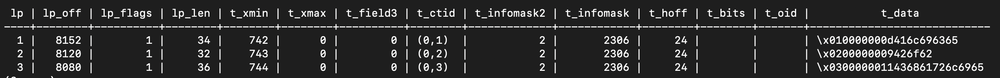
* `lp_len` is actual data size in a tuple (tupleHeader + tupleData).
- Actual tuple data stored from `t_hoff` and size of data is `lp_len`. 
*Ex:* for first row:
  - `lp_len` - `t_hoff` = 34 - 24 = **10 bytes** ( 4 bytes for int + 6 bytes for TEXT - ("Alice" - 5 bytes + 1 length header) )

**Q:**  _First Tuple:_ 8192 → 8152 = 40 bytes, took 40 bytes. What are extra 6 bytes?
* Postgres adds **Padding** to each tuple.
PostgreSQL stores tuples aligned to **MAXALIGN** (usually 8 bytes), so the actual space allocated on the page = next multiple of MAXALIGN.

**Q.** Why 1 byte length header for each value of text (Variable length datatype)?
## our question: row is larger than a single page, how is it handled?
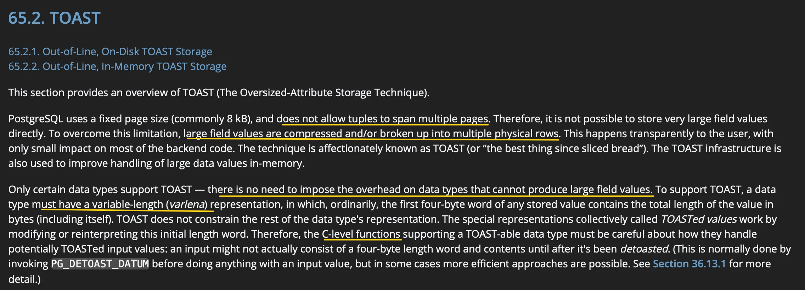

### Q. When does TOAST occur?

### Q. Do every table have a Toast Table associated to it?
No
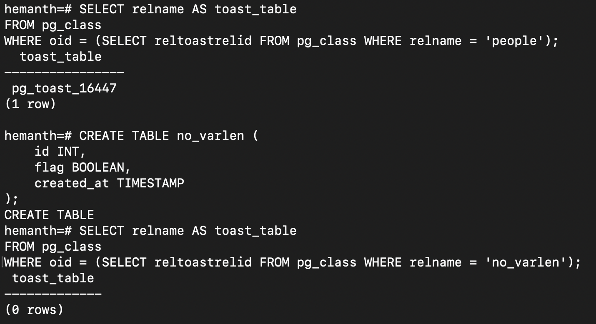
### Storing Toasted Data
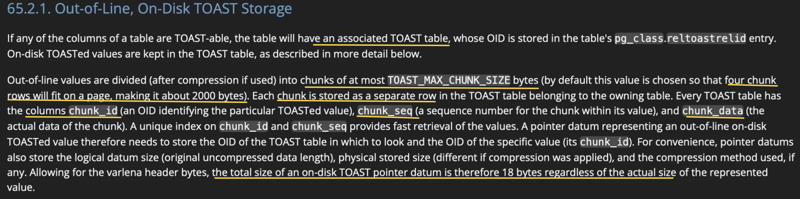

### Toasted Data Example
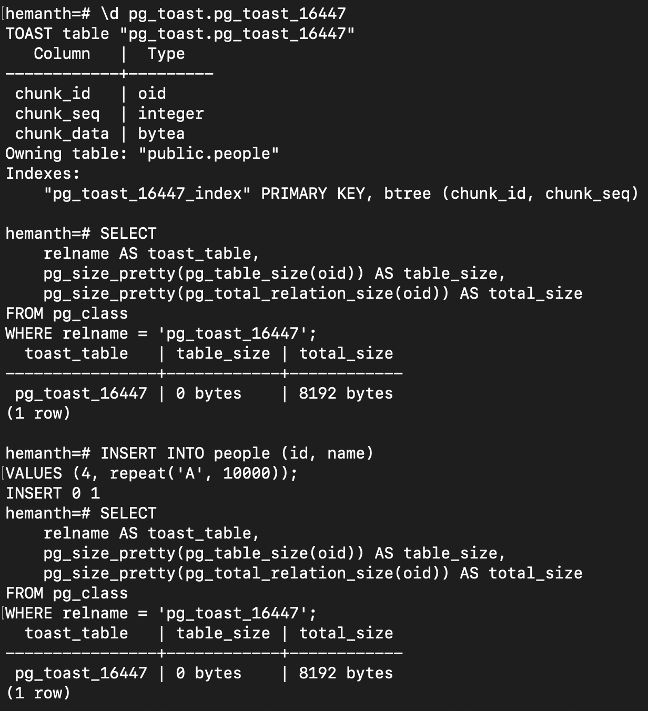
**Q:** Even after adding ~10KB (>threshold), why data is not toasted?
**Compression**
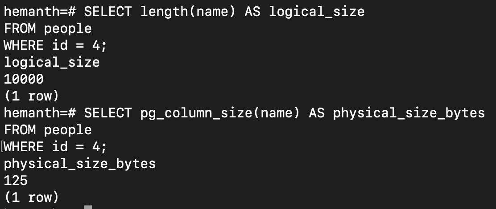

### Adding Large Tuple with Random values

* Size of tuple: 32 * 500 = 16000 bytes
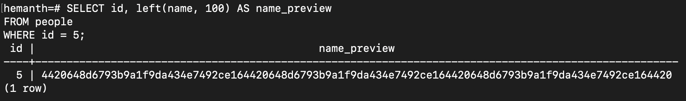
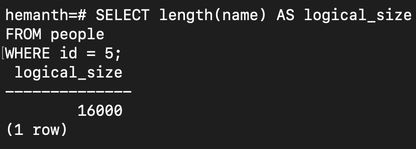
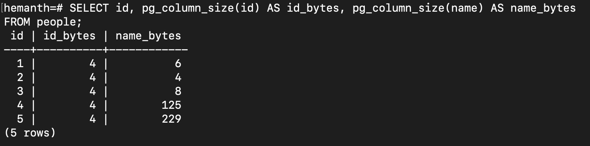

### Adding More than 2KB
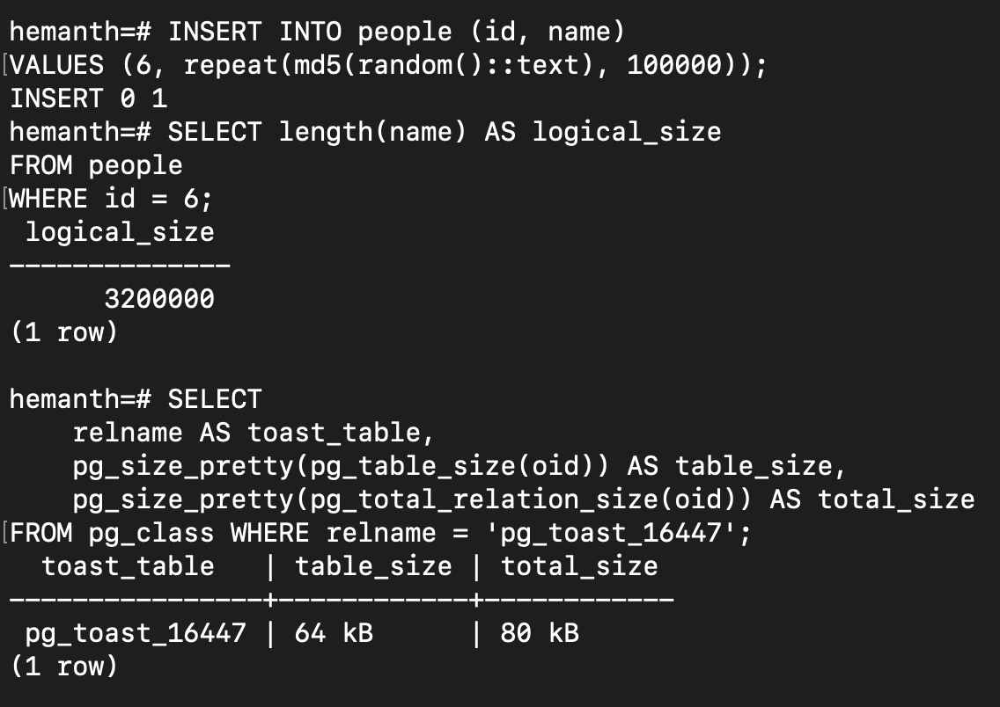
* Size of tuple: 32 * 100000 = 3.2 MB
* Physical Size: 36 KB
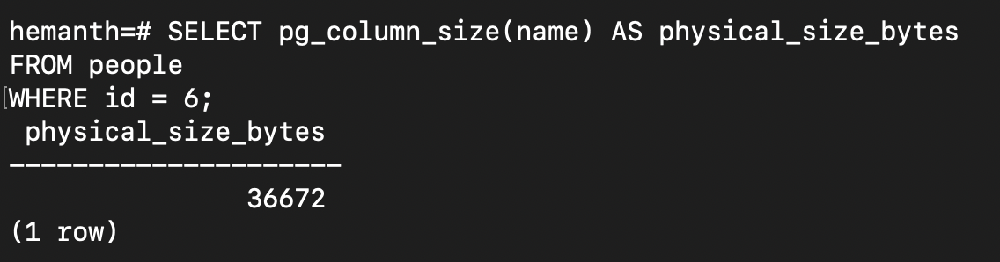
**Q.** How 36KB stored?
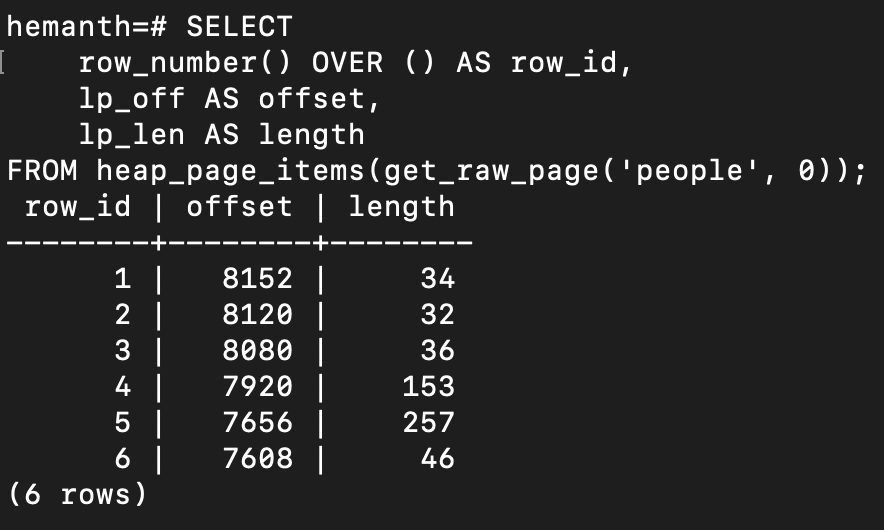
**Q.** What do that 46 bytes contain for last row? How original row maps to TOAST table?
  - Tuple Header: 23 bytes
  - int: 4 bytes
  - name length header: 1 byte
  - name datum: 18 bytes
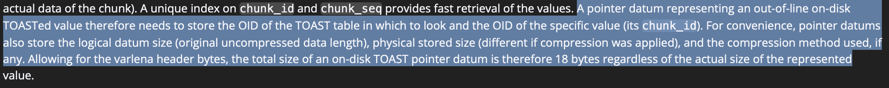
So, in the main table page, only stores pointer datum to the toast table.
**Q.** How the data stored in Toasted Table?
Details [here](#storing-toasted-data)

### Observations
* When a table is created, no disk pages are allocated initially; pages are created only when rows are inserted.
* For variable length data structure, `1 byte` length header is storing along with data in the tuple.
* PostgreSQL stores small values inline; large variable-length values may be TOASTed.
* TOAST tables are created only for tables with TOAST-able (variable-length) columns.
* **Postgres Compress data only when required. Won't compress for some data types.**
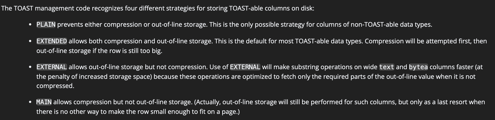
* TOAST triggers when a value cannot fit inline after compression; highly compressible data may stay inline.

_____

2. How much does modern database systems(opensource) -mysql or postgres depend on File Systems of OS?
3. What should be the requirements from a file manager towards supporting a dbms?
4. How many of this requirements are supported by modern database systems?
5. Understand from physical level to file system - what are the inherent constraints current solutions have?
6. If we create file system, What are the disadvantages of our creation. Why is this best solution than existing?
7. How can we build a **simple file manager** that maintains lookup tables and counters, and can create a file with n pages (or a fixed size like 10 MB), allowing new pages to be added?
